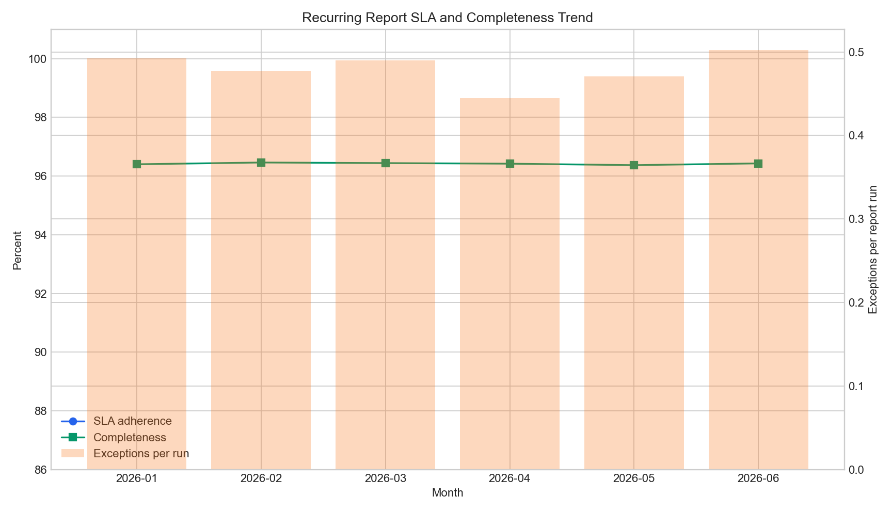
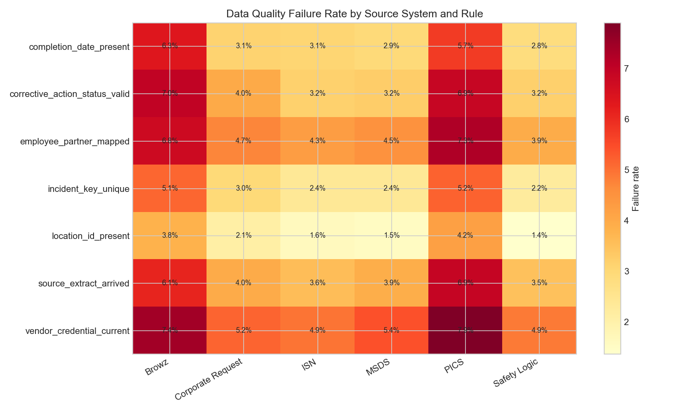
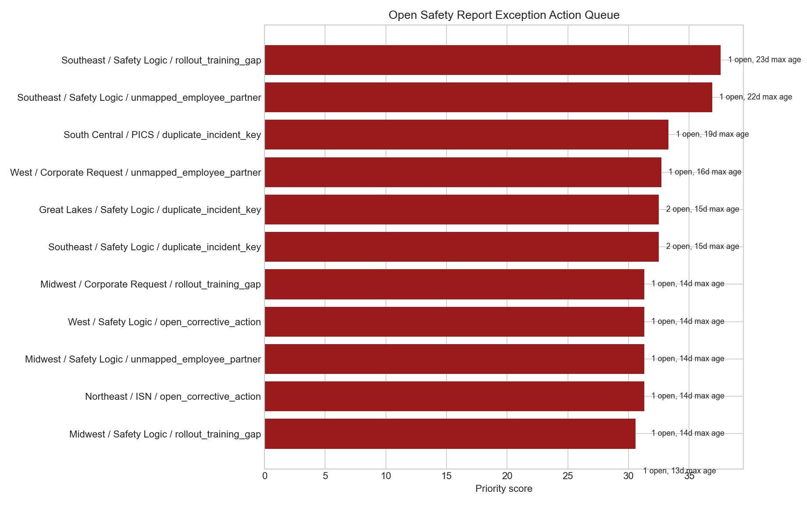
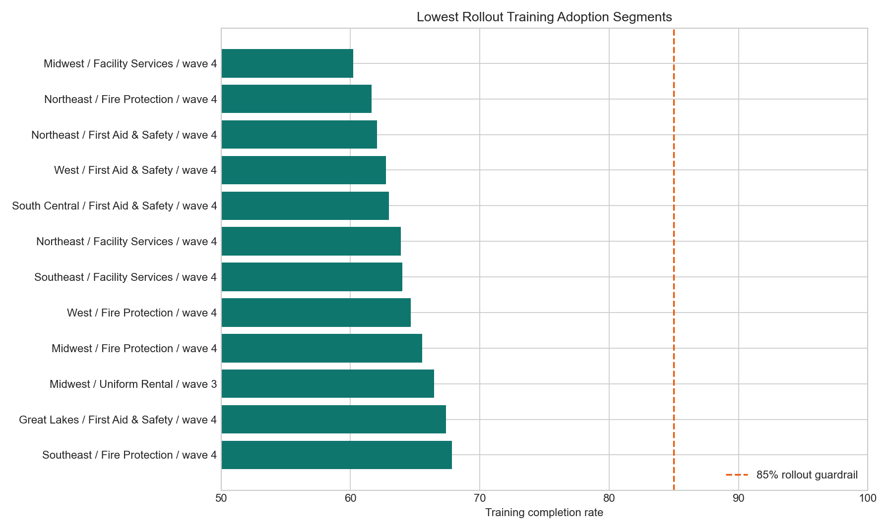

# Safety Reporting Exception Quality Lab

## Motivation

Corporate safety reporting is only useful when field teams trust the recurring reports, understand how to fix exceptions, and receive help before reporting gaps become leadership escalations. This project models a reporting reliability workflow for a distributed field operations environment where safety leaders need daily, weekly, monthly, and ad hoc views to stay complete, timely, and explainable.

## What This Project Is

This is a scripted analyst QA pack for safety reporting operations. It uses synthetic source-style exports to test recurring report SLA adherence, exception aging, data completeness, cleansing rules, rollout training adoption, and field support request turnaround.

The project does not use real Cintas data, real employee records, real safety incidents, or real vendor system extracts. The tables are synthetic and designed to mirror the kind of reporting operations a corporate safety analyst might support.

## Why This Problem Matters

Distributed safety reporting creates two connected risks:

- recurring reports can arrive late or incomplete, which weakens decision confidence for safety leaders;
- field teams can receive exception lists without enough prioritization, which slows correction and training adoption.

A practical analyst workflow needs both data quality controls and operating recommendations. The goal here is not to predict safety outcomes. It is to make the reporting process more reliable and easier for field operations to act on.

## Data Or Evidence Used

The synthetic dataset contains 19,602 source rows across six source-style CSV tables:

- `data/field_locations.csv`: 72 synthetic service locations by region, division, support tier, and rollout wave.
- `data/safety_report_runs.csv`: 8,736 recurring and ad hoc safety report runs with refresh delays, SLA status, completeness, duplicate keys, and unmapped records.
- `data/safety_report_exceptions.csv`: 4,194 report exceptions with severity, owner group, age, status, and field follow-up flags.
- `data/report_rollout_training.csv`: 360 rollout training assignments across modules, audiences, and locations.
- `data/data_quality_checks.csv`: 5,400 row-level quality rule checks across source systems and report runs.
- `data/field_support_requests.csv`: 839 field support requests with priority, requester group, target hours, and turnaround.

The generated outputs live in `analysis/outputs/`, and the rendered evidence images live in `docs/images/`.

## How The Project Works

Run `scripts/build_safety_reporting_quality_lab.py` to regenerate the source tables, analytical outputs, and evidence images. The script:

1. Creates synthetic field locations and report schedules.
2. Simulates report refresh delays, completeness rates, duplicate keys, and unmapped records.
3. Generates exception records based on SLA, source-system, and data-quality pressure.
4. Builds rollout training and field support request tables.
5. Produces summaries, a prioritized exception queue, and rendered charts.

The SQL file in `analysis/sql_checks.sql` documents the checks a reporting analyst would run in a warehouse against equivalent tables.

## Outputs Or Views



The trend view compares monthly SLA adherence, completeness, and exception pressure. It shows whether reliability problems are isolated to a single period or persistent across the operating cadence.



The rule heatmap highlights where cleansing work should start. In the generated run, vendor credential currency and employee-partner mapping are the highest-friction checks for PICS and Browz-style source feeds.



The action queue ranks open exceptions by severity, age, count, and field follow-up need so a corporate safety analyst can prioritize support conversations.



The adoption view isolates the regions, divisions, and go-live waves that are below an 85 percent training guardrail.

## What The Analysis Says

The generated evidence points to four operating issues:

- Recurring report SLA adherence is 81.6 percent, with weaker performance in weekly exception review, PICS readiness tracking, chemical SDS coverage, and vendor credential audit reports.
- Average report completeness is 96.4 percent, but PICS and Browz-style feeds show higher cleansing pressure in credential, employee mapping, completion date, and source-arrival checks.
- There are 502 open high or critical exceptions, which means the exception review workflow needs an explicit owner and aging policy rather than a generic backlog.
- Rollout training completion is 78.5 percent, below the 85 percent guardrail used in the analysis; later go-live waves have the clearest adoption gaps.

## Recommendations

Prioritize PICS and Browz-style source cleansing before the next monthly safety leadership pack because their failure rates are highest in the data-quality summary and their report SLA adherence is below the overall average.

Create a weekly high-severity exception review queue owned jointly by Corporate Safety and field safety leads. The queue should start with the 30 rows in `analysis/outputs/field_exception_action_queue.csv`.

Move rollout training follow-up into the same operating cadence as report exceptions. Segments under the 85 percent completion guardrail should receive targeted office-hour support before expanding report changes to later waves.

Track field support turnaround alongside report reliability. Support request SLA is 75.7 percent in the generated run, which suggests report quality cannot be separated from how quickly field teams get help with access, definitions, and exception questions.

## Repository Structure

```text
.
├── README.md
├── STATUS.md
├── data/
├── data_dictionary.md
├── analysis/
│   ├── analysis_plan.md
│   ├── executive_findings.md
│   ├── sql_checks.sql
│   └── outputs/
├── docs/images/
├── requirements.txt
└── scripts/
```

## How To Run Or Inspect

Install dependencies:

```bash
python3 -m venv .venv
source .venv/bin/activate
pip install -r requirements.txt
```

Regenerate the artifact:

```bash
python3 scripts/build_safety_reporting_quality_lab.py
```

Inspect the analytical outputs:

```bash
ls analysis/outputs
```

## Caveats And Limitations

This project uses synthetic data only. It does not claim real Cintas safety performance, real field operations outcomes, real OSHA-reportable incident rates, or access to Safety Logic, MSDS, ISN, Browz, PICS, or internal corporate safety systems.

The analysis focuses on report reliability and exception operations. It should be paired with real safety subject-matter review before any production policy, OSHA reporting, or employee-partner communication decision.
